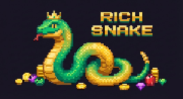

# Neon Serpent: Rich Snake

一个高复杂度、霓虹风格、纯前端的贪吃蛇小游戏。包含多模式、异能系统、粒子特效、音效、皮肤选择与本地数据持久化，并支持可选的云端排行榜接口。

## Live Preview
在线预览：`https://kuroki.wiki`

<!-- readme-pixel-art:start -->
<p align="center">
  
</p>
<!-- readme-pixel-art:end -->

## Features
- 多模式：经典 / 生存 / 限时
- 战术协议：稳态 / 过载 / 连携（影响速度、风险、连击）
- 异能系统：护盾、磁力、加速、冻结、彩虹等
- 合约目标：随机任务，完成可获得霓晶奖励
- 霓晶改造：永久强化磁场、护盾、连击窗口
- 事件/机制：传送门、移动屏障、连击倍率、霓晶遗物
- 视觉：霓虹 UI、粒子特效（星屑/花瓣/叶片/彩虹/棱镜）
- 皮肤：霓虹 / 海洋 / 森林
- 多页面面板：合约/改造/战术提示独立页面，移动端可完整访问
- 音效 + 服务端 SQLite 持久化（按用户名区分数据）
- 可选：云端最高分（/api 接口）

## Controls
- 方向键 / WASD：移动
- 空格 / ESC：暂停
- R：重置
- 触屏模式：屏幕方向键或画布滑动
- 面板按钮：暂停、重置、音效、网格开关

## Run Locally
启动 Node.js 服务（包含 SQLite 数据库与静态资源）：

```bash
npm install
npm start
```

然后访问 `http://localhost:3000`。

页面顶部输入用户名即可登录（仅允许数字/大小写字母/-/_）；新用户名会自动注册。数据按用户名隔离存储在 `data/neon-snake.sqlite`。

## Project Structure
- `neon-snake/`：前端游戏源码
- `neon-snake/js/`：模块化逻辑（配置、输入、导航、存储、音效）
- `neon-snake-game-plan.md`：策划/实现规划记录

## Optional API
前端会尝试访问 `/api/stats`，如果部署了后端可显示“云端最高分”。

## License
MIT
